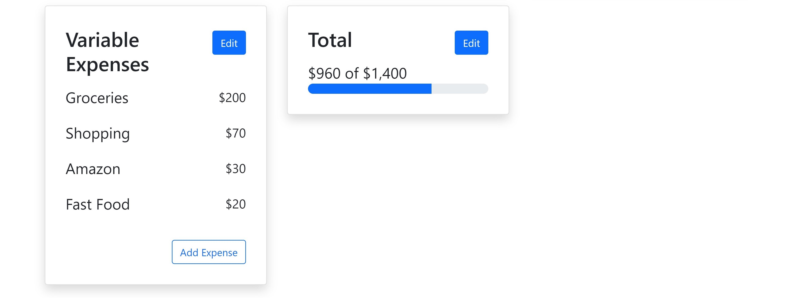

# Budget Planner

This budget feature is designed for a current fintech app that wants to launch a new feature. It allows users to track their income and expenditures, and manage their budget.


## Tech Stack

**Client:** React, Bootstrap


## Features

- Add/delete expenses
- Add/delete budget categories
- See total balance after expenses


## Screenshots





## Run Locally

Clone the project

```bash
  git clone https://github.com/mhyneman8/budget-planner
```

Go to the project directory

```bash
  cd budget-planner
```

Install dependencies

```bash
  npm install
```

Start the server

```bash
  npm run start
```


## Deployment

To deploy this project run

```bash
  npm run deploy
```


## Acknowledgements

 - Lead Developer: [Mallory Hyneman](https://www.github.com/mhyneman8)
 - Lead UX Designer: [Karla Victoria Olteanu](https://www.linkedin.com/in/karlavictoriaolteanu/)
